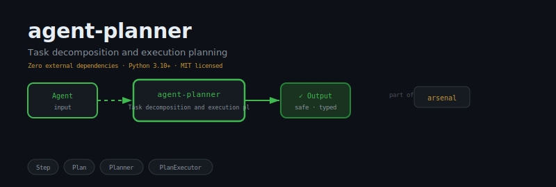
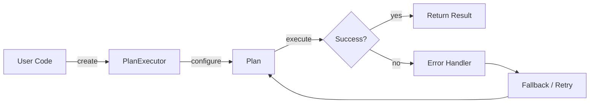
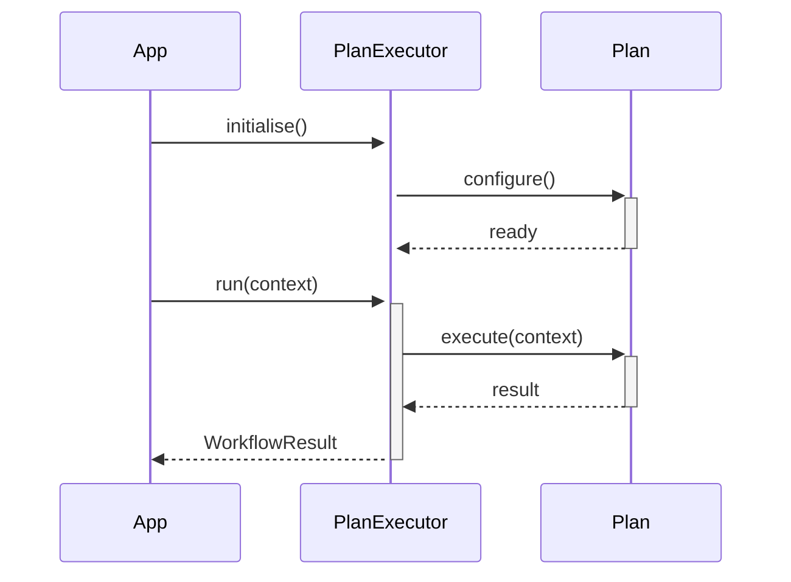

<div align="center">

</div>

# agent-planner

**Task decomposition and execution planning for AI agents**

[](https://pypi.org/project/agent-planner/) [](https://python.org) [](LICENSE) [](#)

---

## The Problem

Without a planner, complex goals become a single monolithic prompt that confuses the model, produces irrelevant sub-steps, and fails silently when goals shift mid-execution. Agents that cannot decompose cannot reason.

## Installation

```bash
pip install agent-planner
```

## Quick Start

```python
from agent_planner import PlanExecutor, Plan, Planner

# Initialise
instance = PlanExecutor(name="my_agent")

# Use
result = instance.run()
print(result)
```

## API Reference

### `PlanExecutor`

```python
class PlanExecutor:
    """Executes a plan by invoking registered handlers for each step."""
    def __init__(self, plan: Plan, handlers: dict[str, Callable] | None = None) -> None:
    def run_step(self, step_id: str) -> bool:
        """Execute a single step by ID. Marks it done or failed. Returns True on success."""
    def run(self) -> dict:
        """Execute all steps in dependency order. Returns final plan summary."""
```

### `Plan`

```python
class PlanExecutor:
    """Executes a plan by invoking registered handlers for each step."""
    def __init__(self, plan: Plan, handlers: dict[str, Callable] | None = None) -> None:
    def run_step(self, step_id: str) -> bool:
        """Execute a single step by ID. Marks it done or failed. Returns True on success."""
    def run(self) -> dict:
        """Execute all steps in dependency order. Returns final plan summary."""
```

### `Planner`

```python
class Planner:
    """Creates and manages execution plans."""
    def __init__(self) -> None:
    def create(self, name: str) -> Plan:
        """Create and register an empty plan."""
    def decompose(self, task: str, steps: list[dict]) -> Plan:
        """Build a plan from a list of step dicts with keys: id, description, depends_on?.
    def linear(self, name: str, descriptions: list[str]) -> Plan:
        """Create a sequential plan where each step depends on the previous.
```


## How It Works

### Flow



### Sequence



## Philosophy

> The Mahabharata was won not on the battlefield but in the *war council*; strategy precedes execution.

---

*Part of the [arsenal](https://github.com/darshjme/arsenal) — production stack for LLM agents.*

*Built by [Darshankumar Joshi](https://github.com/darshjme), Gujarat, India.*
